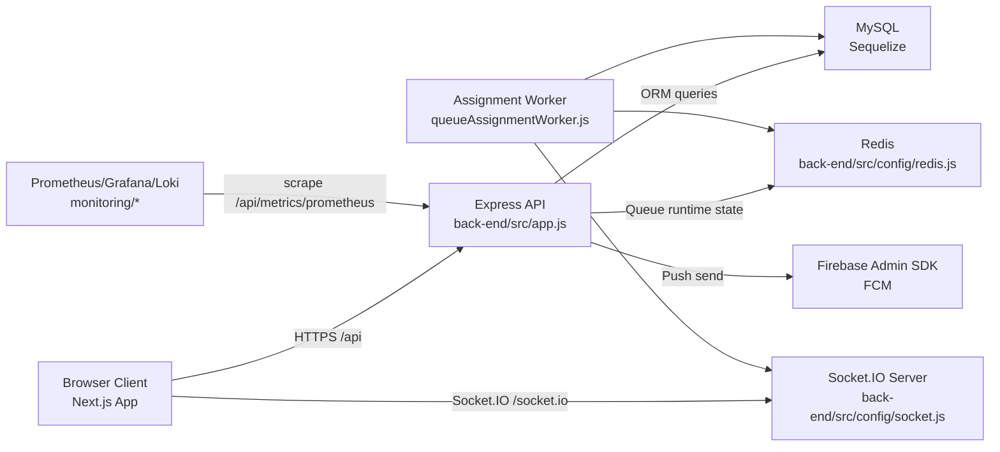

# 04 - System Architecture

## Scope
`Implemented`: derived from runtime and composition files:
- `back-end/src/app.js`
- `back-end/src/config/*.js`
- `back-end/src/routes/index.js`
- `back-end/src/middlewares/*.js`
- `front-end/app/layout.tsx`
- `front-end/app/providers.tsx`
- `front-end/services/api.service.ts`
- `docker-compose*.yml`
- `monitoring/docker-compose*.yml`
- `Jenkinsfile.dev`, `Jenkinsfile.prod`

`Inferred`: topology interpretation and migration-oriented architecture boundaries.

`Needs verification`: infra behavior outside repository (external DB host, reverse proxy outside compose, secrets in deployment system).

## Architecture Summary
The legacy system is a multi-tier web platform with:
- a Next.js frontend (`front-end`) using App Router and client-side auth/session state
- an Express backend (`back-end`) with route-controller-model pattern and JWT-based auth
- MySQL as system of record (Sequelize ORM)
- Redis for high-churn queue runtime state and assignment coordination
- Socket.IO for realtime synchronization (attendance and queue operations)
- Firebase Cloud Messaging (FCM) for web push notifications
- Prometheus/Grafana/Loki/Alertmanager stack for monitoring (separate compose stack)

## Runtime Component Topology

## Backend Architecture
### Process bootstrap and middleware pipeline
`Implemented` in `back-end/src/app.js`:
1. security and HTTP middleware: `helmet`, `cors`, `cookie-parser`, `express-rate-limit`
2. request handling middleware: JSON/urlencoded body parsing, request ID, timeout, slow-request logging
3. auth init: Passport JWT/local/OAuth strategies (`back-end/src/config/passport.js`)
4. static files: `/uploads`
5. metrics instrumentation: `metricsMiddleware` (`back-end/src/middlewares/metrics.js`)
6. request logging (`requestLogger`)
7. API mount: `/api` -> `back-end/src/routes/index.js`
8. centralized error handling: `notFoundHandler`, `errorConverter`, `errorHandler`

### API composition
`Implemented` route aggregation in `back-end/src/routes/index.js`:
- domain modules: auth, users, students, courses, classrooms, attendance, scores, queue, feedback, logs, notifications, OAuth
- monitoring module mounted on two prefixes: `/api/metrics` and `/api/monitoring`

### Data and state layers
`Implemented`:
- persistent domain data: MySQL + Sequelize models (`back-end/src/models/*.js`)
- high-frequency queue state: Redis (`back-end/src/utils/redisQueueService.js`)
- background queue assignment: `back-end/src/utils/queueAssignmentWorker.js`

`Inferred`:
- deliberate split between transactional persistence (MySQL) and low-latency operational state (Redis) to reduce lock contention in queue workflow.

## Frontend Architecture
### Application shell
`Implemented`:
- root layout and metadata: `front-end/app/layout.tsx`
- provider composition: `front-end/app/providers.tsx`
  - `SocketProvider` (`front-end/contexts/SocketContext.tsx`)
  - `NotificationProvider` (`front-end/contexts/NotificationContext.tsx`)
  - auth sync via `BroadcastChannel` (`front-end/services/auth.service.ts`)

### Client networking pattern
`Implemented`:
- central HTTP client with token refresh/retry behavior: `front-end/services/api.service.ts`
- API base URL from env: `front-end/config/api.ts` (`NEXT_PUBLIC_API_URL`)
- route middleware is lightweight and defers full auth checks to client/layout flow: `front-end/middleware.ts`

## Realtime and Async Architecture
### Socket layer
`Implemented`:
- socket server setup and room handlers: `back-end/src/config/socket.js`
- queue and attendance controllers emit room-scoped events
  - queue emits from `back-end/src/controllers/queue.controller.js`
  - assignment worker emits from `back-end/src/utils/queueAssignmentWorker.js`
  - attendance emits via helpers from `back-end/src/controllers/attendance.controller.js`

### Background processing
`Implemented`:
- worker polls active sessions and performs assignment matching (`queueAssignmentWorker.js`)
- lock strategy uses Redis lock key (`queue:{sessionId}:assignment:lock`) in `redisQueueService.js`

### Push notifications
`Implemented`:
- backend send path: `back-end/src/utils/fcmService.js`
- token register/unregister API: `back-end/src/controllers/notification.controller.js`
- frontend service worker handler: `front-end/public/firebase-messaging-sw.js`

## Observability Architecture
`Implemented`:
- application metrics via `prom-client` (`back-end/src/middlewares/metrics.js`)
- scrape endpoint: `GET /api/metrics/prometheus` in `back-end/src/routes/monitoring.routes.js`
- admin monitoring APIs query Prometheus and Docker socket (`monitoring.routes.js`)
- monitoring stack in separate compose files:
  - `monitoring/docker-compose.monitoring.yml`
  - `monitoring/docker-compose.monitoring.dev.yml`

## Deployment Architecture
### App stack
`Implemented`:
- development compose: `docker-compose.dev.yml`
  - `traefik`, `backend`, `frontend`, `redis`
- production compose: `docker-compose.prod.yml`
  - `backend`, `frontend`, `redis`

`Needs verification`:
- production reverse proxy location/config is not explicitly modeled in `docker-compose.prod.yml`.

### Database stack
`Implemented`:
- MySQL + phpMyAdmin in `docker-compose.db.yml`

`Needs verification`:
- compose references `./project_ta_prod.sql` at repo root while SQL dumps are under `back-end/migrations/`.

### CI/CD
`Implemented`:
- Jenkins pipelines generate env files at deploy time:
  - `back-end/.env.dev` / `back-end/.env.prod`
  - `front-end/.env.local.dev` / `front-end/.env.local.prod`
  - root `.env` for compose build args
- files: `Jenkinsfile.dev`, `Jenkinsfile.prod`

## Architecture Characteristics
`Implemented`:
- strong route/controller/domain separation in backend
- centralized API client and token lifecycle logic in frontend
- explicit soft-realtime queue model (Redis + worker + Socket.IO)

`Needs verification`:
- `back-end/src/services` and `back-end/src/repositories` are empty; target layering intent for V2 is unclear.

## Recommended Future Behavior (V2)
`Recommended`:
- formalize module boundaries into explicit domain services (especially queue, attendance, scoring).
- standardize event contracts with versioned schemas for Socket.IO and push payloads.
- isolate queue assignment worker and Redis contract behind a dedicated internal API boundary.
- define a single deployment reference architecture (reverse proxy, env strategy, secret management, observability SLOs).

## V2 Migration Notes
### What must be preserved
- API surface and auth/security middleware intent (`back-end/src/routes/*.routes.js`, `back-end/src/middlewares/auth.js`).
- queue runtime pattern (Redis operational state + async assignment worker + socket notifications).
- attendance and score flows where realtime and policy checks are tightly coupled.

### What can be redesigned
- internal layering (`services`/`repositories`) and code organization as long as API/event behavior remains compatible.
- frontend composition and module structure if route behavior and critical UX flows are preserved.
- CI/CD tooling (Jenkins/compose) if deployment guarantees remain equivalent.

### What is risky to rewrite
- `back-end/src/controllers/queue.controller.js`
- `back-end/src/utils/redisQueueService.js`
- `back-end/src/utils/queueAssignmentWorker.js`
- `back-end/src/controllers/attendance.controller.js`
- auth + 2FA + token/session chain in `auth.controller.js`, `twoFactor.controller.js`, `RefreshToken` handling

### What business logic is critical
- role and authentication enforcement
- course-active write gates
- queue state transitions and assignment correctness under concurrency
- attendance status calculation and check-in validity checks
- score and score-edit lifecycle governance

## Needs Verification
- production network topology beyond compose files (external reverse proxy / ingress settings).
- whether hardcoded Firebase web config values in frontend are intentional for all environments.
- final authoritative location of DB seed/init SQL used by production DB bootstrap.